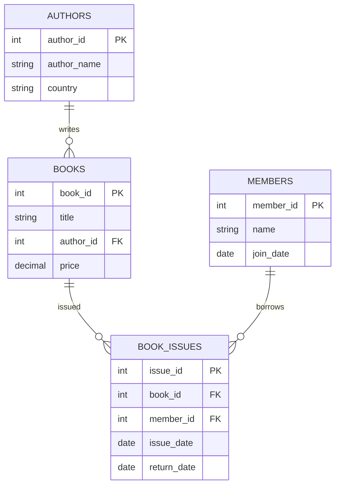

# Library Management System - ER Diagram

```mermaid
erDiagram

    AUTHORS ||--o{ BOOKS : writes
    BOOKS ||--o{ BOOK_ISSUES : issued
    MEMBERS ||--o{ BOOK_ISSUES : borrows

    AUTHORS {
        int author_id PK
        string author_name
        string country
    }

    BOOKS {
        int book_id PK
        string title
        int author_id FK
        decimal price
    }

    MEMBERS {
        int member_id PK
        string name
        date join_date
    }

    BOOK_ISSUES {
        int issue_id PK
        int book_id FK
        int member_id FK
        date issue_date
        date return_date
    }
```